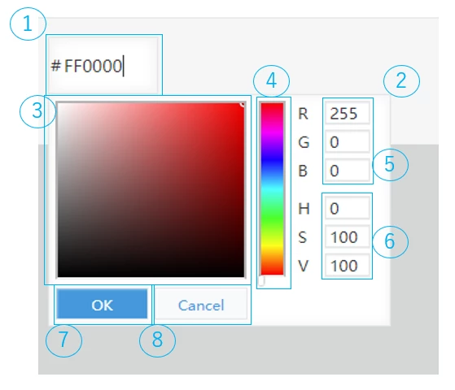

# ColorPicker

## Overview


|Number|Description|
| --- | --- |
|1|HEX input|
|2|ColorPicker popup window|
|3|Saturation|
|4|Hue|
|5|RGB input|
|6|HSV input|
|7|OK button|
|8|Cancel button|

## Constructor

**Parameter**

| Name| Type| Required| Description |
| --- | --- | --- | --- |
|options|Object|No|The object contains params of constructor.|
|options.color|String|No|The ColorPicker's input value.Can set like 'red' or '#e74c3c' or 'rgba(0, 0, 0, 1)'.<br>If setted color is not valid ,it's value will be changed to #000000.<br> Default value is ''|
|options.isDisabled|Boolean|No|The ColorPicker will be disabled. <br> Default value: 'false'|
|options.isVisible|Boolean|No|The ColorPicker will be visible. <br> Default value: 'true'|
|options.onAccept|Callback|No|Handler for ok button click event|
|options.onCancel|Callback|No|Handler for cancel button event|
|options.onChangeComplete|Callback|No|Handler for color change event|

<details class="tab-container" open>
<Summary>Sample</Summary>

**Javascript**
```
var colorPicker = new kintoneUIComponent.ColorPicker({color: '#FF0000'});
```
**React**
```
import { ColorPicker } from '@kintone/kintone-ui-component';
import React from 'react';
  
export default class Plugin extends React.Component {
    state = {color: '#FF0000'}
    render() {
        return (
            <ColorPicker color={this.state.color} />
        );
    }
}

```
</details>

## Methods
### render()
Get dom element of component.

**Parameter**

None

**Returns**

Dom element

<details class="tab-container" open>
<Summary>Sample</Summary>

**Javascript**
```
var colorPicker = new kintoneUIComponent.ColorPicker({color: '#FF0000'});
var body = document.getElementsByTagName("BODY")[0];
body.appendChild(colorPicker.render());
```
**React**
```
import { ColorPicker } from '@kintone/kintone-ui-component';
import React from 'react';
 
export default class Plugin extends React.Component {
    state = {color: '#FF0000'}
    render() {
        return (
            <ColorPicker color={this.state.color} />
        );
    }
}

```
</details>

### setColor(color)
Set the color of colorpicker .

**Parameter**

| Name| Type| Required| Description |
| --- | --- | --- | --- |
|color|	String|	Yes|	The color of colorpicker.|

**Returns**

None

<details class="tab-container" open>
<Summary>Sample</Summary>

**Javascript**
```
var colorPicker = new kintoneUIComponent.ColorPicker({color: '#FF0000'});
var body = document.getElementsByTagName("BODY")[0];
body.appendChild(colorPicker.render());

colorPicker.setColor('#666666');
```
**React**
```
import { ColorPicker } from '@kintone/kintone-ui-component';
import React from 'react';
  
export default class Plugin extends React.Component {
    state = {color: '#FF0000'}
  
    render() {
        return (
        <div>
          <ColorPicker color={this.state.color} />
          <button onClick={this.handleClick}>Click</button>
        </div>
      );
    }
    handleClick= () => {
        this.setState({
            color: '#666666'
        });
    };
}

```
</details>

### getColor()
Get the color of colorpicker.

**Parameter**

None

**Returns**

|Name|Type|Description|
|---|---|---|
|color|	String|	The color of colorpicker.|


<details class="tab-container" open>
<Summary>Sample</Summary>

**Javascript**
```
var colorPicker = new kintoneUIComponent.ColorPicker({color: '#FF0000'});
var body = document.getElementsByTagName("BODY")[0];
body.appendChild(colorPicker.render());

colorPicker.getColor();
```
**React**
```
import { ColorPicker } from '@kintone/kintone-ui-component';
import React from 'react';
  
export default class Plugin extends React.Component {
    state = {color: '#FF0000'}
  
    render() {
        return (
        <div>
          <ColorPicker value={this.state.color}  />
          <button onClick={this.handleClick}>Get Color</button>
        </div>
      );
    }
    handleClick= () => {
        console.log(this.state.color);
    };
}

```
</details>

### on(eventName, callBack)
Register callback for an event

**Parameter**

| Name| Type| Required| Description |
| --- | --- | --- | --- |
|eventName|	String|	Yes|Name of events: <ul><li>'accept' <ul><li>The 'accept' event occurs when click the ok button in the colorpicker </li></ul> </li><li>'cancel'<ul><li>The 'cancel' event occurs when click the cancel button or outside of the colorpicker</li></ul> </li> <li>'changeComplete'<ul><li>The 'changeComplete' event occurs when changing the color in the colorpicker.

**Returns**
<br>None
<br><br><b>Callback data</b>

|Event| Name| Type| Description |
| --- | --- | --- | --- |
|accept|	color |	Object |the current color|
|cancel |color|	Object|	the previous color|
|changeComplete| color|	Object|	the changing color|

<details class="tab-container" open>
<Summary>Sample</Summary>

**Javascript**
```
var colorPicker = new kintoneUIComponent.ColorPicker({color: '#FF0000'});
var body = document.getElementsByTagName("BODY")[0];
body.appendChild(colorPicker.render());

colorPicker.on('accept', function(color) {
    console.log(color.hex);
});   
colorPicker.on('cancel', function(color) {
    console.log(color.hex);
});  
colorPicker.on('changeComplete', function(color) {
    console.log(color.hex);
});  
```
**React**
```
import { ColorPicker } from '@kintone/kintone-ui-component';
import React from 'react';
 
export default class Plugin extends React.Component {
    state = {color: '#FF0000'}
    render() {
        return (
            <ColorPicker value={this.state.color} onAccept={this.handleAccept} 
              onCancel={this.handleCancel} onChangeComplete={this.handleChangeComplete} />
        );
    }
    handleAccept = (color) => {
      console.log(color.hex);
    };
    handleCancel = (color) => {
      console.log(color.hex);
    };
    handleChangeComplete = (color) => {
      console.log(color.hex);
    };
}
```

### show()
Display the colorpicker.

**Parameter**

None

**Returns**

None

<details class="tab-container" open>
<Summary>Sample</Summary>

**Javascript**
```
var colorPicker = new kintoneUIComponent.ColorPicker({color: '#FF0000'});
var body = document.getElementsByTagName("BODY")[0];
body.appendChild(colorPicker.render());

colorPicker.show();
```
**React**
```
import { ColorPicker } from '@kintone/kintone-ui-component';
import React from 'react';
 
export default class Plugin extends React.Component {
    state = {color: '#FF0000'}
    render() {
        return (
            <ColorPicker value={this.state.color} isVisible={true} />
        );
    }
}

```
</details>

### hide()
Hide the colorpicker.

**Parameter**

None

**Returns**

None

<details class="tab-container" open>
<Summary>Sample</Summary>

**Javascript**
```
var colorPicker = new kintoneUIComponent.ColorPicker({color: '#FF0000'});
var body = document.getElementsByTagName("BODY")[0];
body.appendChild(colorPicker.render());

colorPicker.hide();
```
**React**
```
import { ColorPicker } from '@kintone/kintone-ui-component';
import React from 'react';
 
export default class Plugin extends React.Component {
    state = {color: '#FF0000'}
    render() {
        return (
            <ColorPicker value={this.state.color} isVisible={false} />
        );
    }
}

```
</details>

### disable()
Disabled the colorpicker.

**Parameter**

None

**Returns**

None

<details class="tab-container" open>
<Summary>Sample</Summary>

**Javascript**
```
var colorPicker = new kintoneUIComponent.ColorPicker({color: '#FF0000'});
var body = document.getElementsByTagName("BODY")[0];
body.appendChild(colorPicker.render());

colorPicker.disable();
```
**React**
```
import { ColorPicker } from '@kintone/kintone-ui-component';
import React from 'react';
 
export default class Plugin extends React.Component {
    state = {color: '#FF0000'}
    render() {
        return (
            <ColorPicker value={this.state.color} isDisabled={true} />
        );
    }
}

```
</details>

### enable()
Enabled the colorpicker.

**Parameter**

None

**Returns**

None

<details class="tab-container" open>
<Summary>Sample</Summary>

**Javascript**
```
var colorPicker = new kintoneUIComponent.ColorPicker({color: '#FF0000'});
var body = document.getElementsByTagName("BODY")[0];
body.appendChild(colorPicker.render());

colorPicker.enable();
```
**React**
```
import { ColorPicker } from '@kintone/kintone-ui-component';
import React from 'react';
 
export default class Plugin extends React.Component {
    state = {color: '#FF0000'}
    render() {
        return (
            <ColorPicker value={this.state.color} isDisabled={false} />
        );
    }
}

```
</details>
