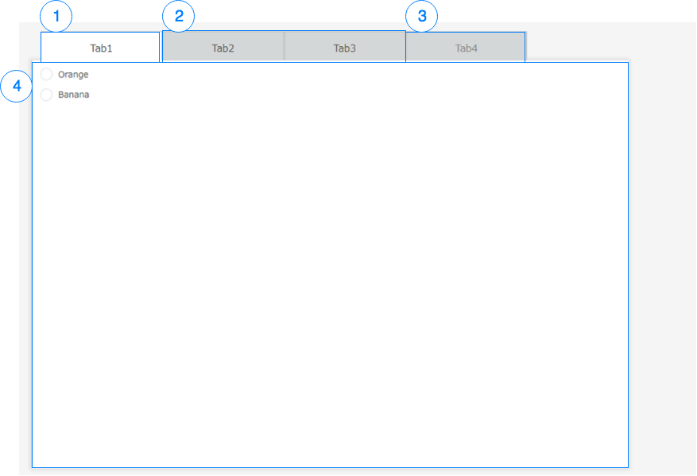

# Tabs

## Overview


|Number|	Description|
| --- | --- |
|1|Selected Tab|	
|2|Not selected Tab|
|3|Disabled Tab|	
|4|Tab content|

## Constructor

**Parameter**

| Name| Type| Required| Description |
| --- | - | --- | ----- |
|options|Object|Yes|An object contains params of constructor.|
|options.items|Array&lt;Object&gt;|No|List of tabs.|
|options.columns[x].tabName|String|Yes|Name of a tab.|
|options.columns[x].tabContent|String|No|The value of an item.|
|options.columns[x].isDisabled|Boolean|No|Indicate if tab will be disabled. <br> Default value: 'false'|
|options.value|Integer|No|Index of selected tab.|

<details class="tab-container" open>
<Summary>Sample</Summary>

**Javascript**
```
var tab = new kintoneUIComponent.Tabs({
    items: [
        {
            tabName: "Tab1",
            tabContent: "This is Tab1"
        },
        {
            tabName: "Tab2",
            tabContent: "This is Tab2"
        },
    　  {
            tabName: "Tab3",
            tabContent: "This is Tab3"
        }
　  ]
});
```
**React**
```
import { Tabs } from '../src/js/components-react/index';
import React from 'react';
import ReactDOM from 'react-dom';
 
class Sample extends React.Component {
    constructor(opts) {
        super(opts);
        var items = [
            {
                tabName: "Tab1",
                tabContent: 'This is Tab1'
            },
            {
                tabName: "Tab2",
                tabContent: "This is Tab2"
            },
            {
                tabName: "Tab3",
                tabContent: "This is Tab3"
            }
        ];
        this.state = { items: items, value: 1};
    }
 
    render() {
        return (
            <div>
                <Tabs items={this.state.items} value={this.state.value} />
            </div>
        );
    }
}
```
</details>

## Methods
### render()
Get dom element of component.

**Parameter**

None

**Returns**

Dom element

<details class="tab-container" open>
<Summary>Sample</Summary>

**Javascript**
```
var el = kintone.app.getHeaderMenuSpaceElement()
var button = new kintoneUIComponent.Button({
    text: 'Hello',
    type: 'submit'
});
button.on('click',function(e){
    alert('hello')
})
var tab = new kintoneUIComponent.Tabs({
    items: [
        {
            tabName: "Tab1",
            tabContent: button.render()
        },
        {
            tabName: "Tab2",
            tabContent: "This is Tab2"
        },
    　  {
            tabName: "Tab3",
            tabContent: "This is Tab3"
        }
　  ]
});
el.appendChild(tab.render());
```

**React**
```
import { Tabs } from '../src/js/components-react/index';
import React from 'react';
import ReactDOM from 'react-dom';
 
class Sample extends React.Component {
    constructor(opts) {
        super(opts);
        var items = [
            {
                tabName: "Tab1",
                tabContent: 'This is Tab1'
            },
            {
                tabName: "Tab2",
                tabContent: "This is Tab2"
            },
            {
                tabName: "Tab3",
                tabContent: "This is Tab3"
            }
        ];
        this.state = { items: items, value: 1};
    }
 
    render() {
        return (
            <div>
                <Tabs items={this.state.items} value={this.state.value} />
            </div>
        );
    }
}
 
kintone.events.on('app.record.index.show', function (event) {
    ReactDOM.render(
        <Sample />,
        kintone.app.getHeaderSpaceElement()
    );
});
```
</details>

### addItem(item)
Add an item to end of the tab list.

**Parameter**

| Name| Type| Required| Description |
| --- | --- | --- | --- |
|item|	Object|	Yes|	The new tab to be added.|
|item.tabName|	String|	Yes|	Name of the new tab.|
|item.tabContent|	String|	No|	Content of the new tab.|
|item.isDisabled|	Boolean|	No|	Indicate tab will be disabled when display. <br>Default value: 'false'.|