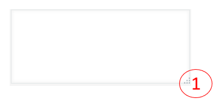

# TextArea

## Overview


|Number|	Description|
| --- | --- |
|1|Drag and drop this icon to resize textarea|	

## Constructor

**Parameter**

| Name| Type| Required| Description |
| --- | --- | --- | --- |
|options|Object|No|The object contains parameters of constructor.|
|options.value|String|No|The value of textarea field.|
|options.isDisabled|Boolean|No|The textarea field will be disabled. <br> Default value: **false**|
|options.isVisible|Boolean|No|The textarea field will be visible. <br> Default value: **true**|

<details class="tab-container" markdown="1" open>
<Summary>Sample</Summary>

**Javascript**
```javascript
var textArea = new kintoneUIComponent.TextArea({value: 'textarea'});
```
**React**
```javascript
import {TextArea} from '@kintone/kintone-ui-component';
import React from 'react';
 
export default class Plugin extends React.Component {
    constructor(props) {
      super(props);
      this.state = { value: 'textarea'};
    };
    render() {
        return (
            <TextArea value={this.state.value} />
        );
    };
};

```
</details>

## Methods
### render()
Get DOM element of TextArea component.

**Parameter**

None

**Returns**

DOM element

<details class="tab-container" markdown="1" open>
<Summary>Sample</Summary>

**Javascript**
```javascript
var textArea = new kintoneUIComponent.TextArea({value: 'textarea'});
var body = document.getElementsByTagName("BODY")[0];
body.appendChild(textArea.render());
```
**React**
```javascript
import {TextArea} from '@kintone/kintone-ui-component';
import React from 'react';
import ReactDOM from 'react-dom'

export default class Plugin extends React.Component {
    constructor(props) {
        super(props);
        this.state = { value: 'Textarea' };
    };

    render() {
        return (
            <TextArea value={this.state.value} />
        );
    };
};

ReactDOM.render(<Plugin />, document.getElementById('root'));
```
</details>

### setValue(value)
Set the input content value of textarea field.   

**Parameter**

| Name| Type| Required| Description |
| --- | --- | --- | --- |
|value|	String|	Yes|The input content value|

**Returns**

None

<details class="tab-container" markdown="1" open>
<Summary>Sample</Summary>

**Javascript**
```javascript
var textArea = new kintoneUIComponent.TextArea({ value: 'textarea' });
var btn = document.createElement('button');
btn.textContent = 'Set Value';
btn.onclick = function() {
     textArea.setValue('set value into textarea');
};
var body = document.getElementsByTagName("BODY")[0];
body.appendChild(textArea.render());
body.appendChild(btn);
```
**React**
```javascript
import {TextArea} from '@kintone/kintone-ui-component';
import React from 'react';

export default class Plugin extends React.Component {
    constructor(props) {
        super(props);
        this.state = { value: 'Textarea' };
    };

    render() {
        return (
        <div>
          <TextArea value={this.state.value} />
          <button onClick={this.setValue}>Set Value</button>
        </div>
      );
    };

    setValue= () => {
        this.setState({
            value: 'set value into textarea'
        });
    };
};

```
</details>

### getValue()
Get the input content of textarea field.

**Parameter**

None

**Returns**

|Name|Type|Description|
|---|---|---|
|value|	String|	The input content value of textarea field.|


<details class="tab-container" markdown="1" open>
<Summary>Sample</Summary>

**Javascript**
```javascript
var textArea = new kintoneUIComponent.TextArea({value: 'textarea'});
var body = document.getElementsByTagName("BODY")[0];
body.appendChild(textArea.render());

console.log(textArea.getValue());
```
**React**
```javascript
import {TextArea} from '@kintone/kintone-ui-component';
import React from 'react';
 
export default class Plugin extends React.Component {
    constructor(props) {
        super(props);
        this.state = { value: 'Textarea' };
    };

    render() {
        return (
            <div>
                <TextArea value={this.state.value} />
                <button onClick={this.getValue}>Get Value</button>
            </div>
        );
    }
    getValue = () => {
        console.log(this.state.value);
    };
};
```
</details>

### on(eventName, callback)
Register callback for an event of TextArea component

**Parameter**

| Name| Type| Required| Description |
| --- | --- | --- | --- |
|eventName |String |Yes|Name of event: <ul><li>'click'</li><li>'change'</li></ul>|
|callback|function |Yes|The callback function call when the event occurs|

**Returns**

None

<details class="tab-container" markdown="1" open>
<Summary>Sample</Summary>

**Javascript**
```javascript
var textArea = new kintoneUIComponent.TextArea({value: 'textarea'});
var body = document.getElementsByTagName("BODY")[0];
body.appendChild(textArea.render());

textArea.on('click', function(event) {
    console.log('onclick', event.target.value);
});

textArea.on('change', function(event) {
    console.log('onchange', event.target.value);
});
```
**React**
```javascript
import {TextArea} from '@kintone/kintone-ui-component';
import React from 'react';

export default class Plugin extends React.Component {
    constructor(props) {
        super(props);
        this.state = { value: 'Textarea' };
    };
    render() {
        return (
            <TextArea
                value={this.state.value}
                onChange={this.onChange.bind(this)}
                onClick={this.onClick} 
            />
        );
    };
    onClick = () => {
        console.log('onclick');
    };
    onChange = (value) => {
        this.setState({ value });
        console.log('onchange: ' + value);
    };
};

```
</details>

### show()
Display the TextArea component.

**Parameter**

None

**Returns**

None

<details class="tab-container" markdown="1" open>
<Summary>Sample</Summary>

**Javascript**
```javascript
var textArea = new kintoneUIComponent.TextArea({value: 'textarea', isVisible: false});
var btn = document.createElement('button'); 
btn.textContent = 'Show';
btn.onclick = function() {
    textArea.show();
};

var body = document.getElementsByTagName("BODY")[0];
body.appendChild(btn);
body.appendChild(textArea.render());
```
**React**
```javascript
import {TextArea} from '@kintone/kintone-ui-component';
import React from 'react';

export default class Plugin extends React.Component {
    constructor(props) {
        super(props);
        this.state = { value: 'Textarea', isVisible: false };
    };
    show = () => {
        this.setState({ isVisible: true });
    };
    render() {
        return (
            <div>
                <TextArea value={this.state.value} isVisible={this.state.isVisible} />
                <button onClick={this.show}>Show</button>
            </div>
        );
    };
};

```
</details>

### hide()
Hide the TextArea component.

**Parameter**

None

**Returns**

None

<details class="tab-container" markdown="1" open>
<Summary>Sample</Summary>

**Javascript**
```javascript
var textArea = new kintoneUIComponent.TextArea({value: 'textarea', isVisible: true});
var btn = document.createElement('button'); 
btn.textContent = 'Hide';
btn.onclick = function() {
    textArea.hide();
};
var body = document.getElementsByTagName("BODY")[0];
body.appendChild(btn);
body.appendChild(textArea.render());
```
**React**
```javascript
import {TextArea} from '@kintone/kintone-ui-component';
import React from 'react';
 
export default class Plugin extends React.Component {
    constructor(props) {
        super(props);
        this.state = { value: 'Textarea', isVisible: true };
    };

    hide = () => {
        this.setState({ isVisible: false });
    };

    render() {
        return (
            <div>
                <TextArea value={this.state.value} isVisible={this.state.isVisible} />
                <button onClick={this.hide}>Hide</button>
            </div>
        );
    };
};

```
</details>

### disable()
Disabled the TextArea component.

**Parameter**

None

**Returns**

None

<details class="tab-container" markdown="1" open>
<Summary>Sample</Summary>

**Javascript**
```javascript
var textArea = new TextArea({value: 'textarea'});
var btn = document.createElement('button'); 
btn.textContent = 'Disable';
btn.onclick = function() {
    textArea.disable();
};
var body = document.getElementsByTagName("BODY")[0];
body.appendChild(btn);
body.appendChild(textArea.render());
```
**React**
```javascript
import {TextArea} from '@kintone/kintone-ui-component';
import React from 'react';
 
export default class Plugin extends React.Component {
    constructor(props) {
        super(props);
        this.state = { value: 'Textarea', isDisabled: false };
    };

    disable = () => {
        this.setState({ isDisabled: true });
    };

    render() {
        return (
            <div>
                <TextArea value={this.state.value} isDisabled={this.state.isDisabled} />
                <button onClick={this.disable}>Disable</button>                
            </div>
        );
    };
};

```
</details>

### enable()
Enabled the TextArea component.

**Parameter**

None

**Returns**

None

<details class="tab-container" markdown="1" open>
<Summary>Sample</Summary>

**Javascript**
```javascript
var textArea = new TextArea({value: 'textarea', isDisabled: true});
var btn = document.createElement('button'); 
btn.textContent = 'Enable';
btn.onclick = function() {
    textArea.enable();
};

var body = document.getElementsByTagName("BODY")[0];
body.appendChild(btn);
body.appendChild(textArea.render());
```
**React**
```javascript
import {TextArea} from '@kintone/kintone-ui-component';
import React from 'react';
 
export default class Plugin extends React.Component {
    constructor(props) {
        super(props);
        this.state = { value: 'Textarea', isDisabled: true };
    };
    enable = () => {
        this.setState({ isDisabled: false });
    };
    render() {
        return (
            <div>
                <TextArea value={this.state.value} isDisabled={this.state.isDisabled} />
                <button onClick={this.enable}>Enable</button>                
            </div>
        );
    };
};

```
</details>
